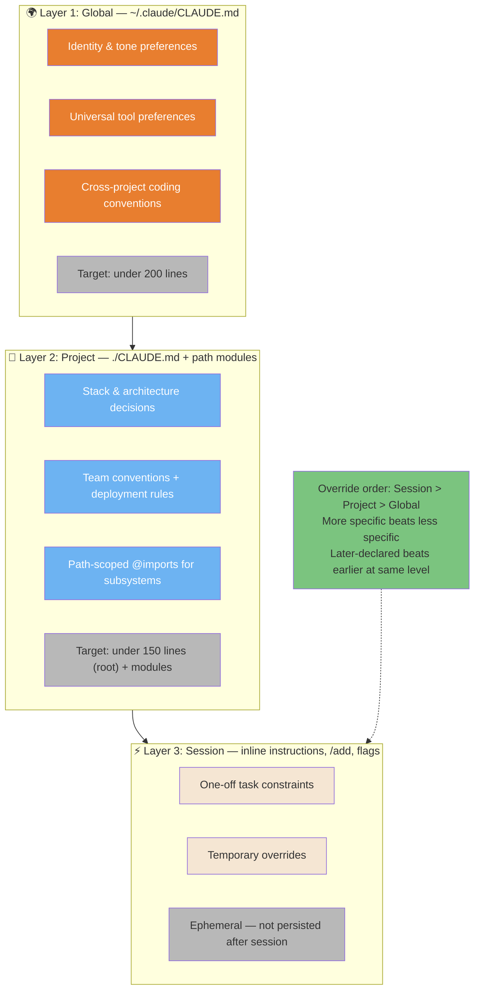
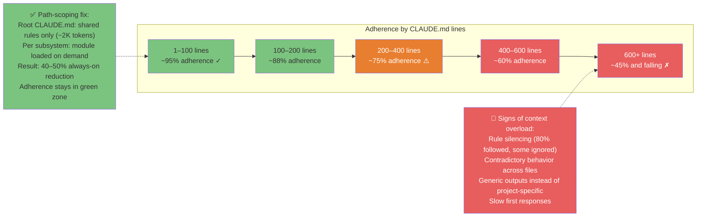
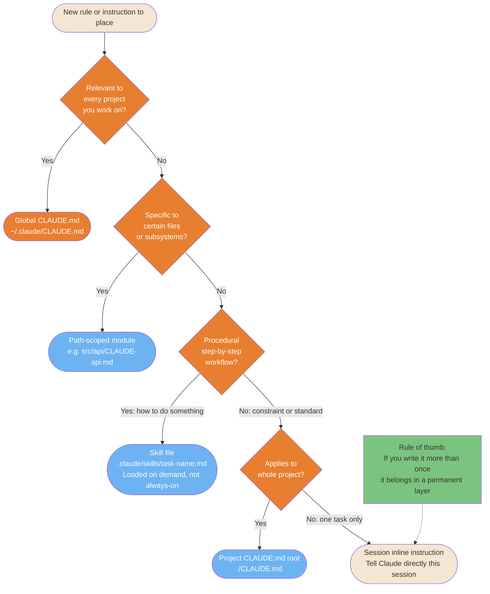

# Context Engineering

How to fill Claude's context window with the right information at the right time — and how architectural choices determine whether Claude consistently follows your conventions.

> "Context engineering is the art of filling the context window with the right information at the right time." — Andrej Karpathy

---

### The 3-Layer Context System

Context engineering operates across 3 distinct layers with different scopes and persistence. Understanding which layer to use prevents the most common mistake: cramming everything into one file.



<details>
<summary>ASCII version</summary>

```
GLOBAL ~/.claude/CLAUDE.md     → Identity, universal tools, cross-project conventions (<200 lines)
    │ overridden by ↓
PROJECT ./CLAUDE.md + modules  → Stack, architecture, team rules, path-scoped @imports (<150 lines root)
    │ overridden by ↓
SESSION inline / /add / flags  → One-off constraints, temporary overrides (ephemeral)

Override order: Session > Project > Global
More specific beats less specific at the same level
```

</details>

> **Source**: [Context Engineering — Configuration Hierarchy](../core/context-engineering.md#3-configuration-hierarchy)

---

### Context Budget & Adherence Degradation

Adherence to CLAUDE.md rules degrades predictably as file size grows. Beyond ~150 rules, models begin selectively ignoring instructions. Path-scoping is the primary fix — it reduces always-on context by 40-50% without losing coverage.



<details>
<summary>ASCII version</summary>

```
Lines in CLAUDE.md    Adherence    Status
──────────────────    ─────────    ──────
1 – 100               ~95%         ✓ Green zone
100 – 200             ~88%         ✓ Acceptable
200 – 400             ~75%         ⚠️ Caution
400 – 600             ~60%         ✗ Degraded
600+                  ~45% ↓       ✗ Critical

Fix: path-scope by subsystem → root CLAUDE.md stays <150 lines
Result: 40-50% always-on context reduction, adherence back in green zone
```

</details>

> **Source**: [Context Budget](../core/context-engineering.md#2-the-context-budget) — Adherence data: HumanLayer production data (15-25% improvement with structured context)

---

### Monolithic vs. Modular Architecture

The monolithic CLAUDE.md is the most common failure mode in team contexts. Path-scoped modules fix it by loading only what's relevant for the current task.

```mermaid
flowchart TD
    subgraph BAD["❌ Anti-Pattern: Monolithic CLAUDE.md"]
        B1(["CLAUDE.md (600 lines)<br/>API rules + DB rules + UI rules<br/>+ Deploy rules — all mixed together"])
        B2("All 600 lines loaded<br/>for every session, every file")
        B3("Rules 1–20 get ~95% attention<br/>Rules 500+ get ~30% attention")
        B4(["Adherence degrades continuously"])
        B1 --> B2 --> B3 --> B4
        style B1 fill:#E85D5D,color:#fff
        style B2 fill:#E85D5D,color:#fff
        style B3 fill:#E87E2F,color:#fff
        style B4 fill:#E85D5D,color:#fff
    end

    subgraph GOOD["✅ Best Practice: Path-Scoped Modules"]
        G1(["CLAUDE.md root (~100 lines)<br/>Shared rules only + @import declarations"])
        G2["src/api/CLAUDE-api.md<br/>Loaded ONLY when in src/api/"]
        G3["src/components/CLAUDE-components.md<br/>Loaded ONLY when in src/components/"]
        G4["prisma/CLAUDE-db.md<br/>Loaded ONLY when in prisma/"]
        G5(["Each module: full coverage<br/>Always-on: 40–50% smaller"])
        G1 --> G2
        G1 --> G3
        G1 --> G4
        G2 & G3 & G4 --> G5
        style G1 fill:#7BC47F,color:#333
        style G2 fill:#6DB3F2,color:#fff
        style G3 fill:#6DB3F2,color:#fff
        style G4 fill:#6DB3F2,color:#fff
        style G5 fill:#7BC47F,color:#333
    end

    click B1 href "https://github.com/FlorianBruniaux/claude-code-ultimate-guide/blob/main/guide/core/context-engineering.md#4-modular-architecture" "Anti-pattern: monolith"
    click B4 href "https://github.com/FlorianBruniaux/claude-code-ultimate-guide/blob/main/guide/core/context-engineering.md#2-the-context-budget" "Adherence degradation"
    click G1 href "https://github.com/FlorianBruniaux/claude-code-ultimate-guide/blob/main/guide/core/context-engineering.md#4-modular-architecture" "Root CLAUDE.md"
    click G2 href "https://github.com/FlorianBruniaux/claude-code-ultimate-guide/blob/main/guide/core/context-engineering.md#4-modular-architecture" "API module"
    click G3 href "https://github.com/FlorianBruniaux/claude-code-ultimate-guide/blob/main/guide/core/context-engineering.md#4-modular-architecture" "Components module"
    click G4 href "https://github.com/FlorianBruniaux/claude-code-ultimate-guide/blob/main/guide/core/context-engineering.md#4-modular-architecture" "DB module"
    click G5 href "https://github.com/FlorianBruniaux/claude-code-ultimate-guide/blob/main/guide/core/context-engineering.md#4-modular-architecture" "Result: coverage with less bloat"
```



<details>
<summary>ASCII version</summary>

```
BAD: CLAUDE.md (600 lines, everything mixed)
  → All 600 lines loaded every session
  → Rules 500+ get ~30% attention weight
  → Adherence degrades continuously

GOOD: Root CLAUDE.md (~100 lines, shared only)
  + src/api/CLAUDE-api.md      ← loaded only when editing API files
  + src/components/CLAUDE-*.md ← loaded only when editing components
  + prisma/CLAUDE-db.md        ← loaded only when editing DB files

Result: 40-50% reduction in always-on tokens, full coverage per subsystem
```

</details>

> **Source**: [Modular Architecture](../core/context-engineering.md#4-modular-architecture) — Path-scoping pattern

---

### Rule Placement Decision Tree

Every new instruction or convention needs to land in the right layer. Wrong placement wastes tokens (too global) or loses coverage (too scoped). This tree makes the decision explicit.



<details>
<summary>ASCII version</summary>

```
New rule to place
│
Relevant to every project? ──Yes──► Global CLAUDE.md (~/.claude/CLAUDE.md)
│ No
Specific to certain files/subsystems? ──Yes──► Path-scoped module (src/area/CLAUDE-area.md)
│ No
Procedural step-by-step? ──Yes──► Skill file (.claude/skills/) [loaded on demand]
│ No
Applies to whole project? ──Yes──► Project CLAUDE.md root (./CLAUDE.md)
│ No
└──► Session inline instruction (ephemeral)

Rule of thumb: if you say it more than once, promote it to a permanent layer.
```

</details>

> **Source**: [Rule Placement](../core/context-engineering.md#3-configuration-hierarchy) — Decision tree from §3
