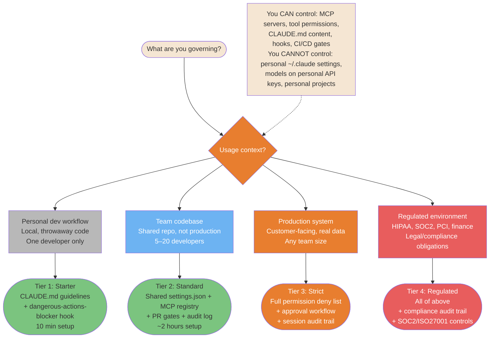
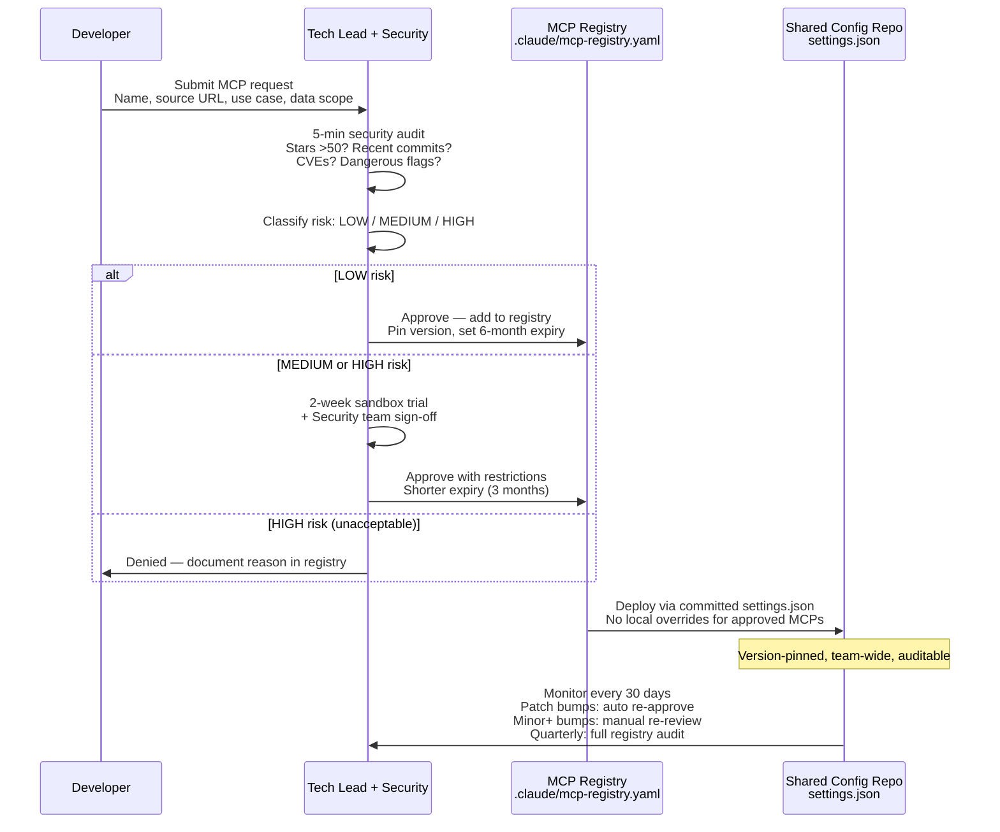

# Enterprise Governance

Org-level patterns for teams deploying Claude Code at scale — usage tiers, MCP approval workflows, and guardrail configurations.

> **Audience**: Tech leads, engineering managers, security officers. For individual dev security see [Security & Production](./08-security-and-production.md).

---

### Governance Risk Tiers — What to Control and When

Not everything needs heavy governance. This decision tree routes your context to the right control level based on actual risk — from personal dev workflow (minimal) to regulated environments (full compliance stack).



<details>
<summary>ASCII version</summary>

```
Usage context?
├─ Personal dev workflow      → Tier 1: Starter     (CLAUDE.md + basic hooks, 10 min)
├─ Team codebase              → Tier 2: Standard    (shared settings.json + MCP registry + PR gates)
├─ Production system          → Tier 3: Strict      (full deny list + approval + audit trail)
└─ Regulated (HIPAA/SOC2/PCI) → Tier 4: Regulated  (all above + compliance audit trail)

You CAN control: settings.json in repo, CLAUDE.md, hooks, CI/CD gates, MCP registry
You CANNOT control: personal ~/.claude, personal API key model choice, personal projects
```

</details>

> **Source**: [Enterprise Governance](../security/enterprise-governance.md) — §1 Governance Split, §4 Guardrail Tiers

---

### MCP Governance Workflow

Individual MCP vetting takes 5 minutes. Organizational MCP governance is the 5-step pipeline that ensures approved servers stay approved, versions are pinned, and risk is classified before deployment.



<details>
<summary>ASCII version</summary>

```
Developer submits MCP request (name, source, use case, data scope)
    │
Tech Lead: 5-min security audit (stars, commits, CVEs, flags)
    │
Classify risk: LOW / MEDIUM / HIGH
    │
┌───┴────────────────────────────┐
LOW                             MED/HIGH
Approve immediately             2-week sandbox trial
                                + Security team sign-off
    │
Add to registry (.claude/mcp-registry.yaml)
  - Pin exact version
  - Set expiry (6 months for LOW, 3 months for MED)
  - Document approved scope
    │
Deploy via committed settings.json (no local overrides)
    │
Monitor every 30 days:
  - Check security advisories
  - Patch bumps: auto | Minor+ bumps: manual re-review
  - Quarterly: full registry audit
```

</details>

> **Source**: [MCP Governance Workflow](../security/enterprise-governance.md#3-mcp-governance-workflow) — §3.1 Approval Workflow

---

### Data Classification & Claude Code Access Rules

Data classification determines what Claude Code is allowed to read and process. Getting this wrong is the highest-impact governance failure. Four levels, clear rules, no exceptions for RESTRICTED.

```mermaid
flowchart LR
    subgraph PUBLIC["🟢 PUBLIC"]
        PU1["Open source code<br/>Public documentation<br/>Shared blog content"]
        PU2(["Allowed — no restrictions"])
    end

    subgraph INTERNAL["🔵 INTERNAL"]
        IN1["Internal tools<br/>Non-sensitive code<br/>Team documentation"]
        IN2(["Allowed — standard config"])
    end

    subgraph CONFIDENTIAL["🟠 CONFIDENTIAL"]
        CO1["Internal business secrets<br/>Non-regulated IP<br/>Architecture docs"]
        CO2(["Enterprise plan only<br/>Zero Data Retention required"])
    end

    subgraph RESTRICTED["🔴 RESTRICTED"]
        RE1["Customer PII<br/>PCI card data / PHI<br/>Credentials & API keys"]
        RE2(["NEVER in AI context<br/>Block via permissions.deny<br/>No exceptions"])
    end

    PU1 --> PU2
    IN1 --> IN2
    CO1 --> CO2
    RE1 --> RE2

    style PU2 fill:#7BC47F,color:#333
    style IN2 fill:#6DB3F2,color:#fff
    style CO2 fill:#E87E2F,color:#fff
    style RE2 fill:#E85D5D,color:#fff
    style RE1 fill:#E85D5D,color:#fff

    click PU1 href "https://github.com/FlorianBruniaux/claude-code-ultimate-guide/blob/main/guide/security/enterprise-governance.md#2-ai-usage-charter" "PUBLIC data"
    click IN1 href "https://github.com/FlorianBruniaux/claude-code-ultimate-guide/blob/main/guide/security/enterprise-governance.md#2-ai-usage-charter" "INTERNAL data"
    click CO1 href "https://github.com/FlorianBruniaux/claude-code-ultimate-guide/blob/main/guide/security/enterprise-governance.md#2-ai-usage-charter" "CONFIDENTIAL data"
    click RE1 href "https://github.com/FlorianBruniaux/claude-code-ultimate-guide/blob/main/guide/security/enterprise-governance.md#2-ai-usage-charter" "RESTRICTED data"
    click PU2 href "https://github.com/FlorianBruniaux/claude-code-ultimate-guide/blob/main/guide/security/enterprise-governance.md#2-ai-usage-charter" "PUBLIC: allowed"
    click IN2 href "https://github.com/FlorianBruniaux/claude-code-ultimate-guide/blob/main/guide/security/enterprise-governance.md#2-ai-usage-charter" "INTERNAL: standard config"
    click CO2 href "https://github.com/FlorianBruniaux/claude-code-ultimate-guide/blob/main/guide/security/enterprise-governance.md#2-ai-usage-charter" "CONFIDENTIAL: Enterprise only"
    click RE2 href "https://github.com/FlorianBruniaux/claude-code-ultimate-guide/blob/main/guide/security/enterprise-governance.md#2-ai-usage-charter" "RESTRICTED: never in AI context"
```



<details>
<summary>ASCII version</summary>

```
PUBLIC       → Allowed, no restrictions
INTERNAL     → Allowed, standard config
CONFIDENTIAL → Enterprise plan only (Zero Data Retention required)
RESTRICTED   → NEVER in AI context (PII, PCI, PHI, credentials)
               Block via: permissions.deny Read(.env, *.key, *.pem, secrets/**)

Hard rule: RESTRICTED data never enters a context window.
Not in prompts, not in files Claude reads, not as examples.
```

</details>

> **Source**: [AI Usage Charter](../security/enterprise-governance.md#2-ai-usage-charter) — §2.1 Data Classification
