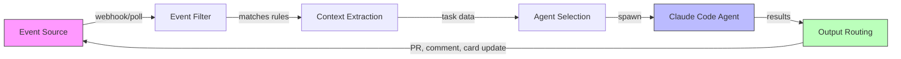
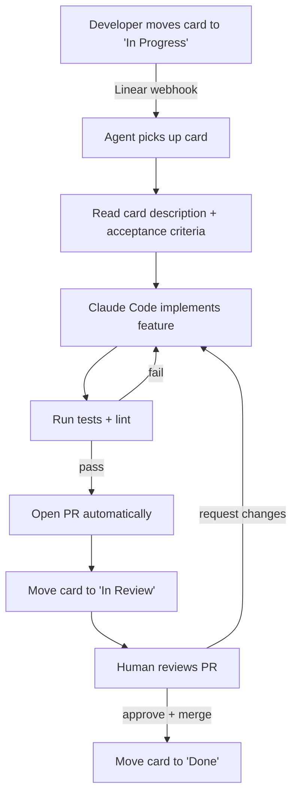

# Event-Driven Agent Automation

> **Confidence**: Tier 3 — Emerging pattern, early adopters report positive results but tooling is still maturing.

Instead of manually invoking Claude Code for each task, let external events drive the work. A card moves to "In Progress" in Linear, and Claude picks it up automatically. A GitHub issue gets labeled `claude-fix`, and an agent starts working on it within seconds.

This is the shift from pull-based ("hey Claude, do this") to push-based ("events trigger agents").

---

## Table of Contents

1. [Core Concept](#core-concept)
2. [The Linear-Driven Agent Loop](#the-linear-driven-agent-loop)
3. [Generic Event-to-Agent Pattern](#generic-event-to-agent-pattern)
4. [Implementation Example](#implementation-example)
5. [Event Source Compatibility](#event-source-compatibility)
6. [Guardrails](#guardrails)
7. [Anti-Patterns](#anti-patterns)
8. [Tools & Resources](#tools--resources)
9. [See Also](#see-also)

---

## Core Concept

Traditional Claude Code usage is interactive: you open a terminal, type a prompt, iterate. Event-driven automation removes the human from the trigger step. The human still reviews output (PRs, code changes), but initiation happens through your existing project management workflow.



The loop is self-reinforcing: the agent's output (a PR, a status update) feeds back into the event source, which can trigger the next step.

---

## The Linear-Driven Agent Loop

The most documented pattern comes from Damian Galarza's workflow (damiangalarza.com, February 2026). Linear serves as the single source of truth for what needs doing, and Claude Code handles implementation end to end.

### Flow



### What makes it work

The card description acts as the prompt. Good cards with clear acceptance criteria produce good code. Vague cards produce vague code, same as with human developers. The quality of your tickets directly determines the quality of the automation.

Linear's structured fields (description, acceptance criteria, labels, priority) map naturally to Claude Code's needs: what to build, how to verify it, and what constraints apply.

### Key requirements

- Cards must have clear acceptance criteria (not just a title)
- The repo needs a solid test suite for automated verification
- Branch naming conventions should be deterministic (e.g., `feat/LINEAR-123-card-title`)
- PR templates help standardize the agent's output

---

## Generic Event-to-Agent Pattern

The Linear example is specific, but the pattern generalizes to any event source. Five components make up the pipeline:

### 1. Event Source

Where the trigger originates. Could be a project management tool, a CI system, a monitoring alert, or a custom webhook.

### 2. Event Filter

Not every event should spawn an agent. Filters determine which events are actionable:

```bash
# Example: only process cards with the "claude-auto" label
if [[ "$CARD_LABELS" != *"claude-auto"* ]]; then
    echo "Skipping: no claude-auto label"
    exit 0
fi
```

### 3. Context Extraction

Pull the relevant data from the event payload and format it as a Claude Code prompt. This is where you translate from your tool's schema to natural language instructions.

### 4. Agent Selection

Different event types might need different agent configurations. A bug report needs a different CLAUDE.md context than a feature request. You might use different allowed tools, different models, or different safety constraints.

### 5. Output Routing

Where do the results go? Typically a combination of:
- Git branch + PR (code changes)
- Comment on the original issue/card (status updates)
- State transition on the card (moving to next column)
- Slack notification (human awareness)

---

## Implementation Example

A minimal bash loop that polls Linear for "In Progress" cards and spawns Claude Code agents:

```bash
#!/bin/bash
# linear-agent-loop.sh
# Polls Linear for cards in "In Progress" state and spawns Claude agents

LINEAR_API_KEY="${LINEAR_API_KEY:?Missing LINEAR_API_KEY}"
TEAM_ID="${LINEAR_TEAM_ID:?Missing LINEAR_TEAM_ID}"
PROCESSED_FILE="/tmp/linear-agent-processed.txt"
MAX_CONCURRENT=3

touch "$PROCESSED_FILE"

poll_linear() {
    curl -s -X POST https://api.linear.app/graphql \
        -H "Authorization: $LINEAR_API_KEY" \
        -H "Content-Type: application/json" \
        -d '{
            "query": "query { team(id: \"'"$TEAM_ID"'\") { issues(filter: { state: { name: { eq: \"In Progress\" } }, labels: { name: { eq: \"claude-auto\" } } }) { nodes { id title description } } } }"
        }' | jq -r '.data.team.issues.nodes[] | "\(.id)|\(.title)|\(.description)"'
}

spawn_agent() {
    local issue_id="$1"
    local title="$2"
    local description="$3"

    echo "[$(date)] Spawning agent for: $title ($issue_id)"

    claude --print --dangerously-skip-permissions \
        "Implement the following Linear card:
        Title: $title
        Description: $description

        Requirements:
        1. Create a feature branch named feat/$issue_id
        2. Implement the described feature
        3. Run tests and fix any failures
        4. Create a PR with the card title" \
        2>&1 | tee "/tmp/agent-$issue_id.log"

    echo "$issue_id" >> "$PROCESSED_FILE"
}

while true; do
    active_agents=$(jobs -r | wc -l)
    if [ "$active_agents" -ge "$MAX_CONCURRENT" ]; then
        echo "[$(date)] Max concurrent agents reached ($MAX_CONCURRENT), waiting..."
        sleep 30
        continue
    fi

    poll_linear | while IFS='|' read -r id title description; do
        if grep -q "$id" "$PROCESSED_FILE"; then
            continue  # Already processed
        fi
        spawn_agent "$id" "$title" "$description" &
    done

    sleep 60  # Poll interval
done
```

This is a starting point, not production code. Real deployments need proper error handling, a persistent state store (not a text file), and webhook-based triggers instead of polling.

---

## Event Source Compatibility

| Event Source | Trigger Events | Agent Use Case | Integration Method |
|-------------|----------------|----------------|-------------------|
| **Linear** | Card state change, label added | Feature implementation, bug fix | GraphQL API / MCP server |
| **GitHub Issues** | Issue created, labeled | Bug triage, investigation, fix PR | GitHub Actions / webhooks |
| **GitHub PR** | PR opened, review requested | Code review, automated fixes | GitHub Actions |
| **Jira** | Transition, sprint assignment | Feature work, tech debt cleanup | REST API / webhooks |
| **Slack** | Message in channel, emoji reaction | Quick fixes, investigations | Slack API / bot |
| **PagerDuty** | Incident created | Diagnostic scripts, initial triage | Webhooks |
| **Custom webhook** | Any HTTP POST | Anything | Direct HTTP endpoint |

---

## Guardrails

Event-driven agents run with less human oversight by design, so guardrails become critical.

### Idempotency

An agent might process the same event twice (network retry, duplicate webhook). The agent must check if work already exists before starting:

```bash
# Check if branch already exists for this card
if git ls-remote --heads origin "feat/$ISSUE_ID" | grep -q "feat/$ISSUE_ID"; then
    echo "Branch already exists, skipping"
    exit 0
fi
```

### Rate Limiting

Don't let a burst of events spawn 50 agents simultaneously. Set hard limits:

- **Max concurrent agents**: 3-5 for most teams
- **Cooldown period**: Minimum 30 seconds between agent spawns
- **Daily budget cap**: Set a maximum token spend per day

### Circuit Breaker

If agents keep failing on a particular type of task, stop trying:

```bash
FAILURE_COUNT=$(grep -c "FAILED" "/tmp/agent-failures.log" 2>/dev/null || echo 0)
if [ "$FAILURE_COUNT" -gt 5 ]; then
    echo "Circuit breaker triggered: too many failures"
    # Notify human, pause automation
    exit 1
fi
```

### Human-in-the-Loop Checkpoints

Even in fully automated flows, keep humans in the loop at critical points:

- PR review remains manual (agents create PRs, humans approve them)
- Database migrations never auto-apply
- Deployment is a separate, human-triggered step
- Any card touching auth, billing, or PII requires explicit human approval

---

## Anti-Patterns

| Anti-Pattern | Problem | Solution |
|-------------|---------|----------|
| **Aggressive polling** | Hammering the API every 5 seconds wastes resources, gets you rate-limited | Use webhooks when available, poll no faster than every 60 seconds |
| **No circuit breaker** | Agent fails repeatedly on same task, burning tokens indefinitely | Track failures per task, stop after 3 attempts, alert human |
| **No dead letter queue** | Failed events disappear, nobody knows work was missed | Log failed events to a persistent store for manual review |
| **Unbounded concurrency** | 20 cards move at once, 20 agents spawn, machine melts | Hard cap on concurrent agents (3-5 is reasonable) |
| **Vague cards as prompts** | "Fix the thing" produces garbage code | Enforce card quality standards, skip cards without acceptance criteria |
| **No state persistence** | Script restarts, re-processes everything from scratch | Store processed event IDs in a database, not in-memory |
| **Skipping PR review** | Agent pushes directly to main | Always go through PR flow, humans review the output |

---

## Tools & Resources

### MCP Servers

- **linear-kanban-mcp** (0xikarus on GitHub): Exposes the Linear API for kanban board management directly from Claude Code. Enables reading cards, updating states, and managing labels without leaving the agent context.

### Skills & Platforms

- **skillsllm.com**: Offers a skill that orchestrates the full planning, validation, and execution cycle starting from a Linear card. Handles the translation from card metadata to structured Claude Code prompts.

### Agent Templates

- **Scrum Master Agent** (lobehub.com): Auto-detects whether it is running inside Claude Desktop or Claude Code and adapts its behavior accordingly. Useful as a starting point for context-aware agent design.

---

## See Also

- [agent-teams.md](./agent-teams.md) — Multi-agent parallel coordination
- [iterative-refinement.md](./iterative-refinement.md) — The core prompt-observe-reprompt loop
- [plan-driven.md](./plan-driven.md) — Plan before executing
- [../../examples/agents/](../../examples/agents/) — Ready-to-use agent templates
